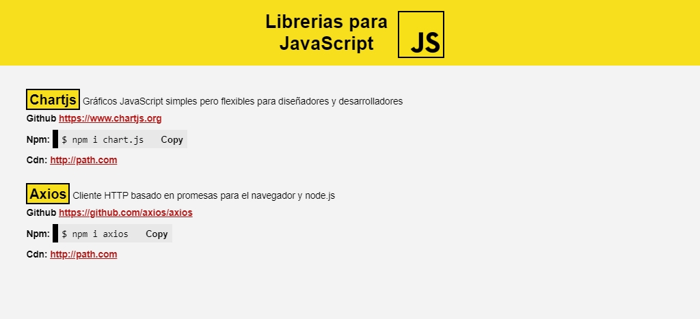

# libraries-js

[](https://linkedin.com/in/edixonalberto)
[](./LICENSE.md)
[](https://paypal.me/edixonp)


Pagina Web realizada con Vue.js para mostrar lista de librerías js

### Utilidades

- Vue **2.9.6**
- live-server **1.2.1**

### Ejecutar

```bash
$ npm install
$ npm start
```

### Imágenes


